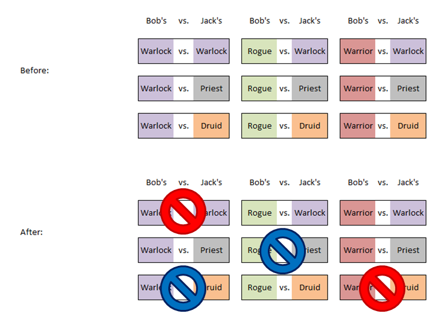

# Hearthstone Strike Ban Phase

Application web pour organiser une phase de ban en format Strike entre deux joueurs sur Hearthstone, avec 3 classes par joueur, une matrice de 9 matchups possibles, 4 bans, puis un ordre aléatoire des 5 matchs restants.

Web app for running a Strike-format ban phase (3 classes, 9 possible matchups, 4 bans -> BO5) between two Hearthstone players.

The app is available here: [https://hearthstone-strike-format-ban-phase.vercel.app/](https://hearthstone-strike-format-ban-phase.vercel.app/)

English README below

## Format Strike

Créé en 2016 par RDU avec l'aide de Gaara, le format Strike (appelé "Destiny" à la base) a pour objectif de permettre de jouer un BO5 avec 3 decks.

Chaque joueur choisit **exactement 3 classes**.

L'application web construit une grille 3 x 3 qui représente tous les matchups possibles entre les classes du joueur A et celles du joueur B.

Les joueurs font **4 bans alternés** (ABBA). À la fin, il reste **5 matchups valides**, qui sont joués dans un ordre aléatoire.

## Résumé du processus

1. Joueur 1 crée le match.
2. Joueur 1 copie le lien d'invitation.
3. Joueur 2 ouvre ce lien et rejoint le match.
4. Les rôles A/B sont attribués aléatoirement.
5. Les 4 bans sont joués à tour de rôle (ABBA).
6. Les 5 matchups restants sont affichés dans un ordre aléatoire.

## Créer un match

1. Ouvrir la page d'accueil.
2. Entrer son pseudo.
3. Sélectionner exactement 3 classes.
4. Cliquer sur **Créer le match**.

## Inviter l'adversaire

Sur la page du match, tant que le second joueur n'a pas rejoint :

1. Cliquer sur **Copier le lien**.
2. Envoyer ce lien à l'adversaire.

## Rejoindre un match

Le joueur qui reçoit le lien d'invitation doit :

1. Ouvrir le lien reçu.
2. Entrer son pseudo.
3. Sélectionner exactement 3 classes.
4. Cliquer sur **Rejoindre**.

## Déroulement de la phase de ban

Quand les deux joueurs ont rejoint :

- les joueurs sont assignés aléatoirement à **Joueur A** et **Joueur B** ;
- les classes du joueur A apparaissent sur les lignes ;
- les classes du joueur B apparaissent sur les colonnes ;
- chaque case du tableau correspond à un matchup possible.

La séquence de bans suit l'ordre affiché par l'interface. Quand c'est au tour d'un joueur, celui-ci peut cliquer sur une case encore disponible.

### Couleurs du tableau

- **Vert** : matchup encore disponible.
- **Rouge** : matchup banni.

Après les 4 bans, l'application verrouille la grille et affiche l'ordre aléatoire des 5 matchups restants.

## Résolution rapide des problèmes

### Le bouton « Créer le match » ne fonctionne pas

Vérifier que :

- un pseudo est bien saisi ;
- exactement 3 classes sont sélectionnées.

### « Match not found »

Causes fréquentes :

- URL incomplète ou copiée partiellement ;
- match supprimé ou serveur relancé si le stockage est seulement en mémoire ;
- identifiant de match invalide.

### Un joueur ne peut pas bannir

Vérifier que :

- le bon lien est utilisé ;
- c'est bien son tour ;
- la case n'a pas déjà été bannie.

---

# Hearthstone Strike Ban Phase

Web application designed to run a Strike-format ban phase between two Hearthstone players, with 3 classes per player, a grid of 9 possible matchups, 4 bans, and then a random order for the 5 remaining matches.

## Strike Format

Created in 2016 by RDU with help from Gaara, the Strike format (originally called "Destiny") was designed to make it possible to play a BO5 with 3 decks. [web:970][web:968]

Each player selects **exactly 3 classes**.

The web app builds a 3 x 3 grid representing all possible matchups between Player A’s classes and Player B’s classes.

The players then perform **4 alternating bans** (ABBA). At the end, **5 valid matchups remain**, and they are played in a random order.

## Process Summary

1. Player 1 creates the match.
2. Player 1 copies the invitation link.
3. Player 2 opens that link and joins the match.
4. A/B roles are assigned randomly.
5. The 4 bans are played in turn order (ABBA).
6. The 5 remaining matchups are displayed in a random order.

## Creating a Match

1. Open the home page.
2. Enter your nickname.
3. Select exactly 3 classes.
4. Click **Créer le match**.

## Inviting the Opponent

On the match page, as long as the second player has not joined yet:

1. Click **Copier le lien**.
2. Send that link to your opponent.

## Joining a Match

The player who receives the invitation link must:

1. Open the received link.
2. Enter their nickname.
3. Select exactly 3 classes.
4. Click **Rejoindre**.

## Ban Phase Flow

Once both players have joined:

- the players are randomly assigned to **Joueur A** and **Joueur B**;
- Player A’s classes appear on the rows;
- Player B’s classes appear on the columns;
- each cell in the grid represents one possible matchup.

The ban sequence follows the order shown by the interface. When it is a player’s turn, that player can click on any still-available cell.

### Grid Colors

- **Green**: matchup still available.
- **Red**: banned matchup.

After the 4 bans, the application locks the grid and displays the random order of the 5 remaining matchups.

## Quick Troubleshooting

### The **Créer le match** button does not work

Check that:

- a nickname has been entered;
- exactly 3 classes have been selected.

### **Match not found**

Common causes:

- incomplete URL or partially copied URL;
- the match was deleted or the server was restarted if storage is only in memory;
- invalid match identifier.

### A player cannot ban

Check that:

- the correct link is being used;
- it is actually that player’s turn;
- the selected cell has not already been banned.

---

### Sources

- https://www.reddit.com/r/hearthstone/comments/56tj8s/how_to_transform_conquest_into_a_great_format/
- https://www.youtube.com/watch?v=j31l-Kl6TcE
- https://www.youtube.com/watch?v=KA4wHSS5izw
- https://blizzpro.com/2016/11/18/rdus-new-tournament-format-strike-app-already-available-beta/

